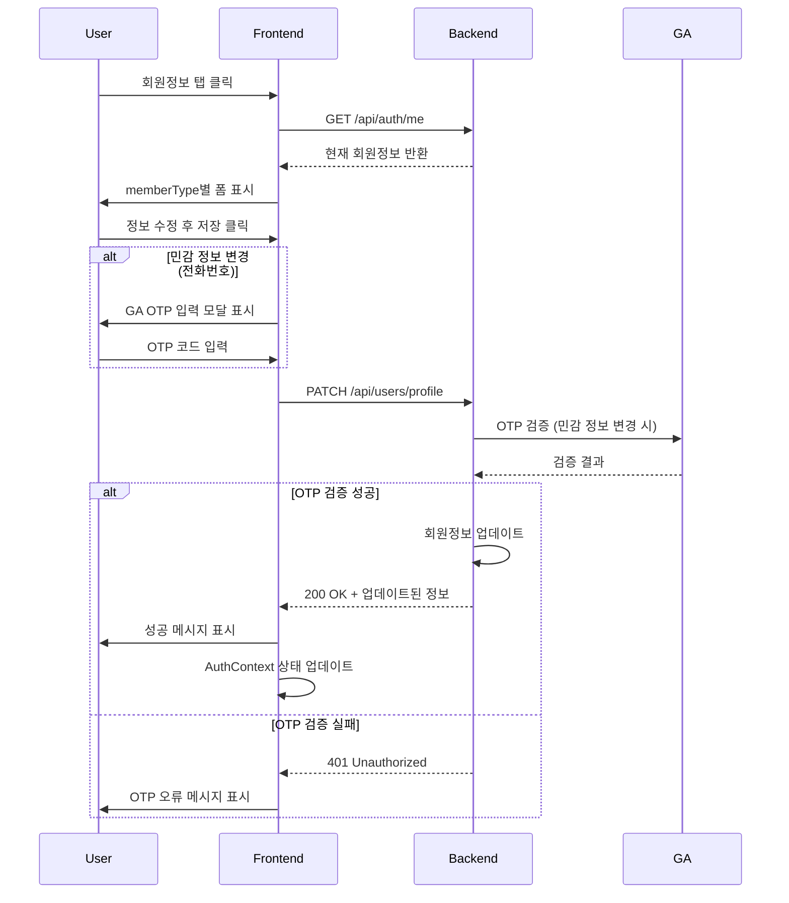

# 회원정보 변경 기능 설계 문서

## 1. 개요

### 목적
Security 페이지에 "회원정보" 탭을 추가하여 사용자가 자신의 회원 정보를 변경할 수 있는 기능 제공

### 범위
- 개인회원과 기업회원의 회원정보 변경 화면 구현
- memberType에 따라 다른 필드 표시 및 변경 가능
- 민감 정보에 대한 추가 인증 로직 (GA OTP 검증)

---

## 2. 시스템 아키텍처

### 2.1 현재 시스템 구조

**Frontend (Next.js 14 + TypeScript)**:
```
/security
├── /security (보안 설정)
├── /addresses (주소 관리)
├── /accounts (계좌 연동)
├── /policies (정책 관리 - 기업회원만)
├── /notifications (알림 설정 - 기업회원만)
└── /profile (NEW - 회원정보)
```

**Backend (Express + Sequelize + PostgreSQL)**:
- User 모델: 개인회원과 기업회원 통합 모델
- JWT 인증 기반 API

### 2.2 데이터 모델

**User 테이블 필드 분석**:

공통 필드:
- id, name, email, phone
- memberType (individual | corporate)
- role, status, lastLogin

개인회원 전용 필드:
- birthDate (생년월일)
- gender (성별)
- residentNumber (주민등록번호)
- identityVerified (본인인증 여부)
- kycLevel (KYC 인증 레벨)
- carrier (통신사)
- fundSource (자금 출처)

기업회원 전용 필드:
- organizationId (조직 ID)
- department (부서)
- position (직급)

---

## 3. API 설계

### 3.1 회원정보 조회 API

**Endpoint**: `GET /api/auth/me`
**인증**: JWT Bearer Token 필요
**설명**: 현재 로그인한 사용자의 정보 조회 (기존 API 활용)

**Response (200 OK)**:
```json
{
  "success": true,
  "user": {
    "id": "user_1234567890_abc123",
    "name": "홍길동",
    "email": "hong@example.com",
    "phone": "010-1234-5678",
    "memberType": "individual",
    "birthDate": "1990-01-01",
    "gender": "male",
    "carrier": "SKT",
    "fundSource": "급여",
    "kycLevel": "level2",
    "identityVerified": true
  }
}
```

### 3.2 회원정보 변경 API

**Endpoint**: `PATCH /api/users/profile`
**인증**: JWT Bearer Token 필요
**설명**: 현재 로그인한 사용자의 정보 변경

**Request Body**:
```json
{
  "name": "홍길동",
  "phone": "010-1234-5678",
  "carrier": "KT",
  "fundSource": "사업소득",
  "department": "IT팀",
  "position": "과장",
  "otpCode": "123456"  // 민감 정보 변경 시 필수
}
```

**Response (200 OK)**:
```json
{
  "success": true,
  "message": "회원정보가 성공적으로 변경되었습니다.",
  "user": {
    "id": "user_1234567890_abc123",
    "name": "홍길동",
    "email": "hong@example.com",
    "phone": "010-1234-5678",
    "memberType": "individual",
    "carrier": "KT",
    "fundSource": "사업소득"
  }
}
```

**Error Responses**:
- `400 Bad Request`: 유효성 검증 실패
- `401 Unauthorized`: OTP 코드 불일치 또는 인증 필요
- `403 Forbidden`: 변경 권한 없음
- `500 Internal Server Error`: 서버 오류

### 3.3 변경 가능한 필드 정책

**개인회원 (individual)**:

변경 가능:
- name (이름)
- phone (전화번호) - OTP 필요
- carrier (통신사)
- fundSource (자금 출처)

변경 불가 (읽기 전용):
- email (이메일)
- birthDate (생년월일)
- gender (성별)
- residentNumber (주민등록번호)
- identityVerified, kycLevel (KYC 관련)

**기업회원 (corporate)**:

변경 가능:
- name (이름)
- phone (전화번호) - OTP 필요
- department (부서)
- position (직급)

변경 불가 (읽기 전용):
- email (이메일)
- organizationId (조직 ID)
- role (역할 - 관리자가 변경)

### 3.4 OTP 검증 필요 필드

다음 필드 변경 시 Google Authenticator OTP 코드 필수:
- phone (전화번호)

---

## 4. 프론트엔드 설계

### 4.1 라우팅 구조

**새로운 라우트 추가**:
```
/security/profile
```

**URL 구조**:
```
http://localhost:3000/security/profile
```

### 4.2 컴포넌트 구조

```
SecuritySettings.tsx (수정)
└── ProfileManagement.tsx (NEW)
    ├── IndividualProfile.tsx (NEW)
    │   ├── 기본 정보 섹션
    │   ├── 연락처 정보 섹션
    │   └── 추가 정보 섹션 (읽기 전용)
    └── CorporateProfile.tsx (NEW)
        ├── 기본 정보 섹션
        ├── 연락처 정보 섹션
        └── 조직 정보 섹션
```

### 4.3 UI/UX 설계

**공통 레이아웃**:
```
┌─────────────────────────────────────────┐
│  회원정보                                 │
│  ━━━━━━━━━━━━━━━━━━━━━━━━━━━━━━━━━━━━  │
│                                          │
│  [기본 정보]                              │
│  ┌────────────────────────────────────┐ │
│  │ 이름:      [홍길동          ]       │ │
│  │ 이메일:    hong@example.com (읽기전용)│ │
│  │ 전화번호:  [010-1234-5678  ] 🔒    │ │
│  └────────────────────────────────────┘ │
│                                          │
│  [memberType별 추가 정보]                 │
│  ┌────────────────────────────────────┐ │
│  │ 개인: 통신사, 자금출처                │ │
│  │ 기업: 부서, 직급                      │ │
│  └────────────────────────────────────┘ │
│                                          │
│  [읽기 전용 정보]                         │
│  ┌────────────────────────────────────┐ │
│  │ 생년월일: 1990-01-01                │ │
│  │ KYC 레벨: Level 2                   │ │
│  └────────────────────────────────────┘ │
│                                          │
│  [저장] [취소]                            │
└─────────────────────────────────────────┘
```

**개인회원 화면 필드**:
1. 기본 정보
   - 이름 (변경 가능)
   - 이메일 (읽기 전용)
   - 전화번호 (변경 가능, OTP 필요)

2. 추가 정보
   - 통신사 (변경 가능)
   - 자금 출처 (변경 가능)

3. KYC 정보 (읽기 전용)
   - 생년월일
   - 성별
   - 본인인증 여부
   - KYC 레벨

**기업회원 화면 필드**:
1. 기본 정보
   - 이름 (변경 가능)
   - 이메일 (읽기 전용)
   - 전화번호 (변경 가능, OTP 필요)

2. 조직 정보
   - 부서 (변경 가능)
   - 직급 (변경 가능)
   - 역할 (읽기 전용)

### 4.4 인터랙션 플로우

**회원정보 변경 플로우**:



### 4.5 상태 관리

**AuthContext 업데이트**:
```typescript
// 회원정보 변경 후 Context 상태 갱신
const { updateUser } = useAuth();

// API 호출 성공 후
updateUser(updatedUserData);
```

---

## 5. 보안 고려사항

### 5.1 인증 및 권한

1. **JWT 인증 필수**: 모든 API 요청에 Bearer Token 필요
2. **본인 정보만 수정 가능**: user.id와 JWT payload의 id 일치 확인
3. **OTP 검증**: 민감 정보 변경 시 GA OTP 코드 필수

### 5.2 데이터 보호

1. **읽기 전용 필드**: 프론트엔드와 백엔드 모두에서 변경 차단
2. **입력 유효성 검증**:
   - 전화번호 형식: 010-XXXX-XXXX
   - 이름: 한글/영문 2-50자
   - 이메일: RFC 5322 표준
3. **민감 정보 마스킹**: residentNumber 등은 일부만 표시

### 5.3 로깅 및 감사

변경 로그 기록:
- 변경 시각
- 변경 사용자
- 변경 전/후 값
- IP 주소

---

## 6. 구현 단계

### Phase 1: 백엔드 API 구현
1. `PATCH /api/users/profile` 엔드포인트 추가
2. OTP 검증 로직 추가
3. 필드별 변경 가능 여부 검증 로직

### Phase 2: 프론트엔드 컴포넌트 구현
1. `ProfileManagement.tsx` 메인 컴포넌트
2. `IndividualProfile.tsx` 개인회원 폼
3. `CorporateProfile.tsx` 기업회원 폼
4. OTP 입력 모달 컴포넌트

### Phase 3: 통합 및 테스트
1. SecuritySettings.tsx에 탭 추가
2. 라우팅 설정
3. 개인/기업회원 시나리오 테스트
4. OTP 검증 플로우 테스트

---

## 7. 테스트 시나리오

### 7.1 개인회원 테스트

**TC-001: 일반 정보 변경 (OTP 불필요)**
- 이름, 통신사, 자금출처 변경
- 예상 결과: 변경 성공, OTP 요구 없음

**TC-002: 전화번호 변경 (OTP 필요)**
- 전화번호 변경 시도
- 예상 결과: OTP 입력 모달 표시, 올바른 OTP 입력 후 변경 성공

**TC-003: 읽기 전용 필드 변경 시도**
- 이메일, 생년월일 변경 시도
- 예상 결과: 변경 불가 (UI에서 비활성화)

### 7.2 기업회원 테스트

**TC-004: 조직 정보 변경**
- 부서, 직급 변경
- 예상 결과: 변경 성공

**TC-005: 역할 변경 시도**
- role 필드 변경 시도
- 예상 결과: 변경 불가 (읽기 전용)

### 7.3 보안 테스트

**TC-006: 타인 정보 변경 시도**
- 다른 사용자 ID로 API 호출
- 예상 결과: 403 Forbidden

**TC-007: 잘못된 OTP 입력**
- 전화번호 변경 시 잘못된 OTP 입력
- 예상 결과: 401 Unauthorized, OTP 오류 메시지

---

## 8. API 명세서 (Swagger)

```yaml
paths:
  /api/users/profile:
    patch:
      summary: 현재 로그인한 사용자의 회원정보 변경
      tags: [Users]
      security:
        - BearerAuth: []
      requestBody:
        required: true
        content:
          application/json:
            schema:
              type: object
              properties:
                name:
                  type: string
                  example: '홍길동'
                phone:
                  type: string
                  example: '010-1234-5678'
                carrier:
                  type: string
                  example: 'SKT'
                fundSource:
                  type: string
                  example: '급여'
                department:
                  type: string
                  example: 'IT팀'
                position:
                  type: string
                  example: '과장'
                otpCode:
                  type: string
                  pattern: '^\d{6}$'
                  example: '123456'
                  description: 'Google Authenticator 6자리 코드 (민감 정보 변경 시 필수)'
      responses:
        200:
          description: 회원정보 변경 성공
          content:
            application/json:
              schema:
                type: object
                properties:
                  success:
                    type: boolean
                  message:
                    type: string
                  user:
                    type: object
        400:
          description: 유효성 검증 실패
        401:
          description: OTP 코드 불일치 또는 인증 필요
        403:
          description: 변경 권한 없음
```

---

## 9. 기술 스택

**프론트엔드**:
- Next.js 14 (App Router)
- TypeScript
- Tailwind CSS
- React Hook Form (폼 관리)
- Zod (유효성 검증)

**백엔드**:
- Express.js
- Sequelize ORM
- PostgreSQL
- OTPAuth (TOTP 검증)

---

## 10. 참고 사항

### 변경 불가능한 필드 정책

**개인정보 보호 및 규제 준수**:
- 이메일: 계정 식별자로 사용되므로 변경 불가
- 생년월일, 성별, 주민등록번호: 본인인증 정보로 변경 불가
- KYC 관련 정보: 인증 시스템에 의해서만 변경 가능

**시스템 무결성**:
- organizationId: 조직 구조 무결성 유지
- role: 권한 관리 시스템에 의해서만 변경 가능

### 향후 확장 가능성

1. **이메일 변경 기능**: 별도의 이메일 인증 프로세스 추가
2. **프로필 이미지**: 사용자 프로필 사진 업로드 기능
3. **변경 이력**: 회원정보 변경 히스토리 조회 기능
4. **알림 설정**: 회원정보 변경 시 이메일/SMS 알림
